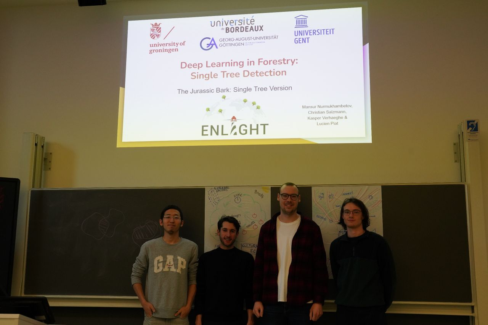
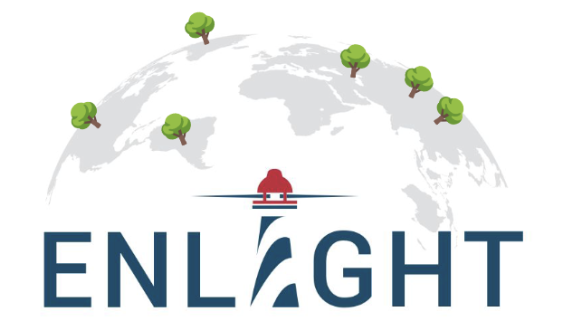
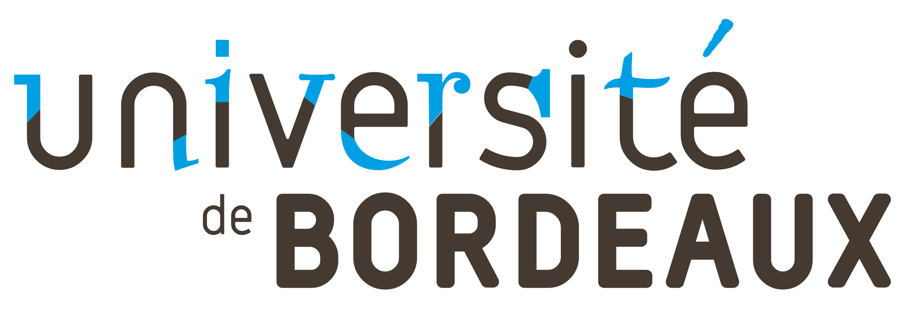
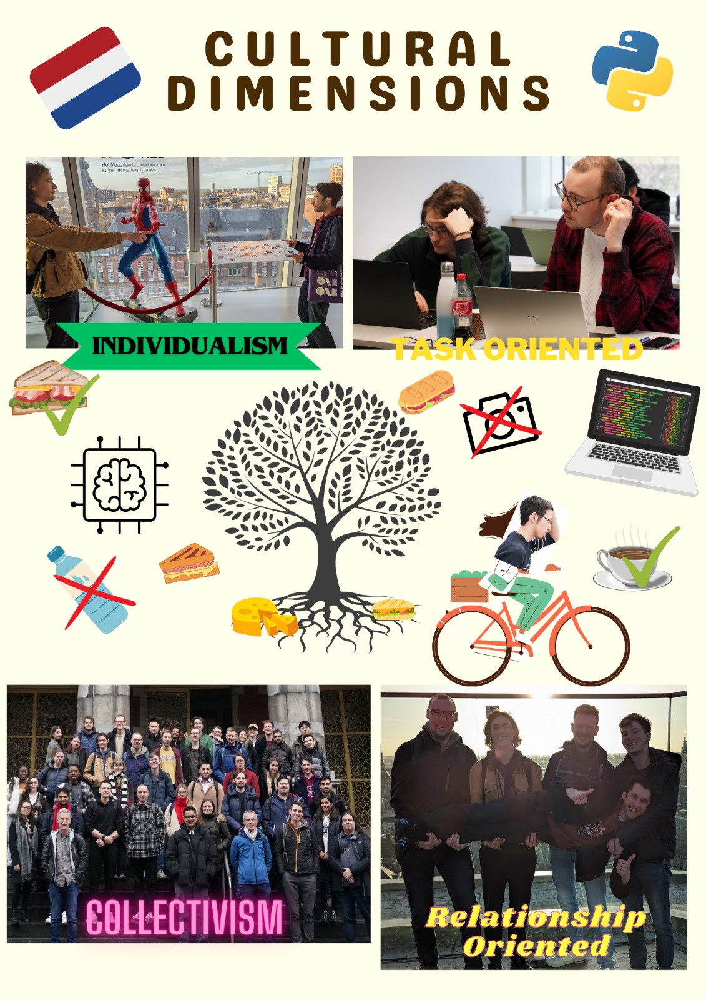
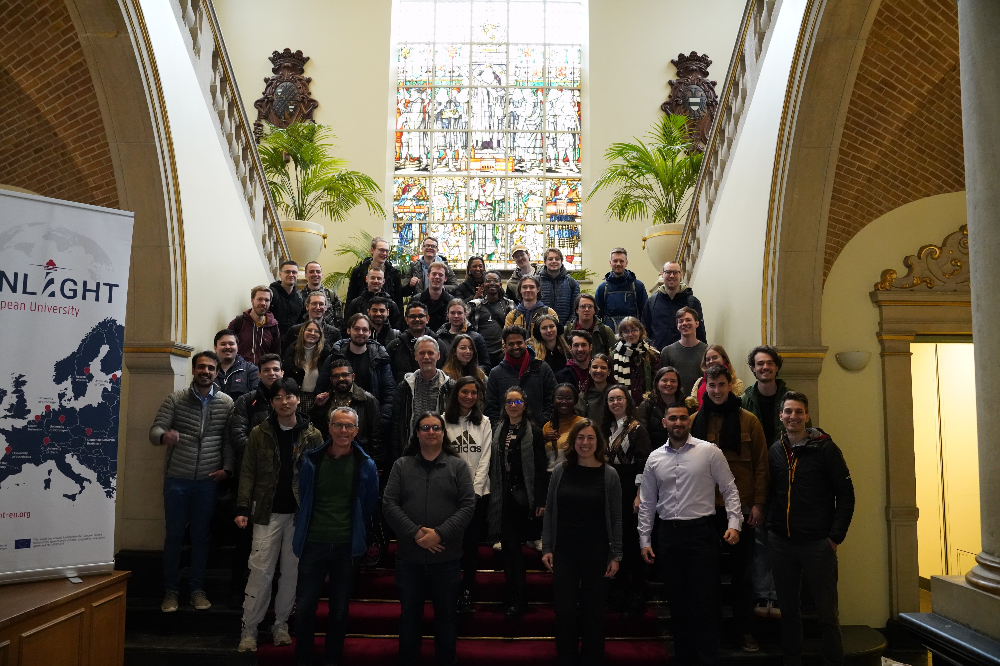
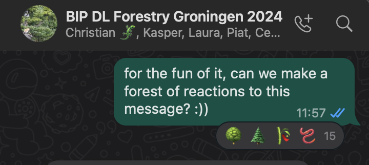

# Deep Learning for Forestry: Single Tree Detection

  
_Left to right: Mansur (me), Lucien, Christian and Kasper._

YOLOv8 segmentation for detecting individual trees in aerial imagery—*The Jurassic Bark: Single Tree Version*. Project from the **ENLIGHT Deep Learning in Forestry** course (Bordeaux, Groningen, Göttingen, Ghent).

---

## What’s in this repo

We fine-tuned **YOLOv8-seg** on labeled tree data: tile images and masks, split into train/valid/test. The pipeline goes from raw tiles and masks (bronze) through preprocessing (silver) to a YOLO-ready dataset (gold). Training and inference are in `train.py` and `run.py`.

---

## Data and approach

**Dataset:** Aerial imagery of **Göttingen** (urban city landscape), Spring 2018. 38 plots with masks, 4 bands (R, G, B, IR). Tiles are 1024×1024 px with 10 cm per pixel—so relatively small data and strong class imbalance. We use an infrared-inclusive band combo (IR, G, B) and separate individual trees in the masks with scikit-image (opening, erosion, labeling). Data augmentation (flip, zoom, 90° rotations, combinations) expands 38 large tiles into 2500+ smaller crops (e.g. 256×256) for training.

**Why YOLOv8:** We considered U-Net-style models (e.g. MobileNetV2, pix2pix) but went with **YOLOv8 instance segmentation**: instance-level detection, whole-image processing in one pass, good with scale variation, and straightforward to train. Suited our “single tree” detection goal.

---

## How to run

**Requirements:** Python 3, dependencies in `requirements.txt` (including `ultralytics` for YOLO).

```bash
pip install -r requirements.txt
```

- **Data:** Put tile images in `data/bronze/tiles` and masks in `data/bronze/masks`, then run `python setup.py` to build `data/silver` and `data/gold` (train/valid/test).
- **Model:** Ensure the base segment weights exist at `model/yolov8n-seg.pt` (downloaded by Ultralytics on first run if missing).
- **Train:** `python train.py` (uses `data/gold/config.yaml`, 100 epochs).
- **Inference:** `python run.py` runs the trained model on the first image in `data/gold/valid` and shows the result (expects `runs/segment/train/weights/best.pt` after training).

Notebooks in `notebooks/` contain the exploratory and pipeline work.

---

## Report and slides

- **Report (Overleaf):** [Deep Learning in Forestry – Single Tree Detection](https://www.overleaf.com/project/65f9a9942034cbe82d2f0f99)
- **Slides:** [Google Slides](https://docs.google.com/presentation/d/1T2WLoDb0O9FV899_YFf19go-xVM4eqg62-x0p6wY0io/edit?usp=sharing)

---

## Story

This came out of the **ENLIGHT** course *Deep Learning in Forestry*, run by four universities—Bordeaux, Groningen, Göttingen, and Ghent.



<p align="center">
  
  
  
  
</p>

Forests are a huge part of our ecosystems and the air we breathe, so monitoring and surveying them matters. Using AI for that—on color and hyperspectral imagery, from satellites (e.g. Copernicus) or UAVs—is a way to cut costs and make sense of large datasets. The course covered Python, TensorFlow/Keras, classical ML and deep learning, and we applied it to a concrete forestry problem: **single tree detection**.

Our team (Mansur, Lucien, Christian, Kasper) built the data pipeline, trained YOLOv8 for segmentation, and presented the project on the last on-site day. Possible next steps: run the model over all of Göttingen, refine labeling, publish the dataset, and try it on other cities.







Big thanks to the lecturers and organisers—Nils Nölke, Lutz Fehrmann, Jean-Christophe Taveau, Matias Valdenegro Toro, Andreea Sburlea and others—for a great course.

---

## Authors

- [Mansur Nurmukhambetov](https://github.com/nomomon)
- [Lucien Piat](https://github.com/Lucien-Piat)
- [Christian Salzmann](https://github.com/Boltimar)
- Kasper Verhaeghe

Forked from [Lucien-Piat/DLF_Single_Tree_Detection](https://github.com/Lucien-Piat/DLF_Single_Tree_Detection).

